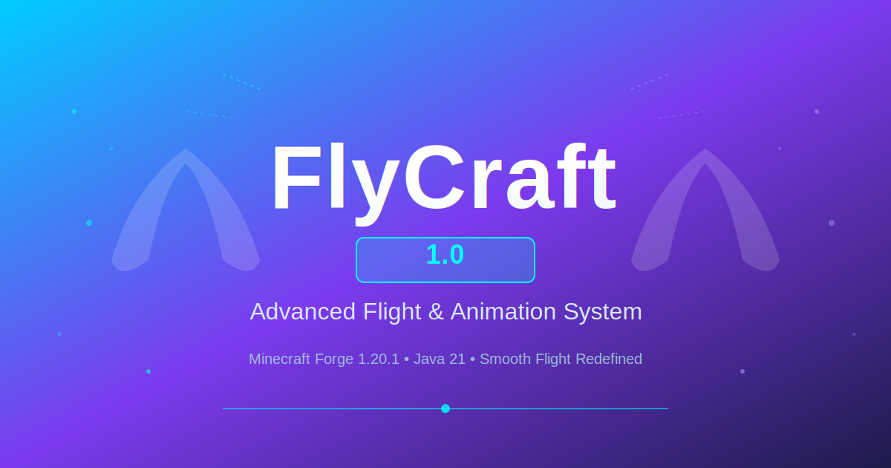

# FlyCraft 1.0 - Cover Banner Guide

## 📸 Banner Overview

Your FlyCraft 1.0 cover banner has been created and is ready to use!

### File Information

```
File: ./assets/cover-banner.svg
Size: 1200x630 pixels
Format: SVG (Vector - scalable)
Style: Professional gradient design
Theme: Cyan to Purple with flight elements
Status: Ready for GitHub
```

---

## 🎨 Design Elements

### Visual Components

1. **Background Gradient**
   - Color 1: Cyan (#00ccff)
   - Color 2: Purple (#7c3aed)
   - Color 3: Deep Blue (#1e1b4b)
   - Creates professional, modern look

2. **Text Elements**
   - Main: "FlyCraft" (120px, bold, white)
   - Version: "1.0" (36px, bold, cyan)
   - Tagline: "Advanced Flight & Animation System" (32px, light gray)
   - Subtitle: "Minecraft Forge 1.20.1 • Java 21 • Smooth Flight Redefined" (20px)

3. **Decorative Elements**
   - Elytra silhouettes (left and right)
   - Particle effects (cyan and purple dots)
   - Motion lines (flight direction indicators)
   - Glow effects on text
   - Bottom decorative line

---

## 🖼️ How to Display in README

### Option 1: Markdown Image (Recommended)

The banner is already integrated at the top of README.md:

```markdown
<div align="center">
  
</div>
```

### Option 2: Centered HTML

```html
<div align="center">
  
</div>
```

### Option 3: Direct Link

```markdown

```

---

## 📱 Display on Different Platforms

### GitHub Repository

The banner displays automatically on:
- ✅ GitHub README preview
- ✅ GitHub repository main page
- ✅ GitHub releases page
- ✅ GitHub web interface

### Web Browsers

The SVG format ensures:
- ✅ Sharp display on all screen sizes
- ✅ Works on desktop and mobile
- ✅ Lightweight file size (~8KB)
- ✅ Scales perfectly (responsive)

### Social Media

You can also share:
- Export as PNG for Twitter/Discord
- Use SVG directly on web platforms
- Share screenshot on social media

---

## 🎨 Customization Options

### How to Edit the Banner

If you want to modify the banner, you can:

1. **Edit SVG Directly**
   - Open `assets/cover-banner.svg` in a text editor
   - Modify colors, text, or elements
   - SVG is human-readable XML format

2. **Use Online SVG Editor**
   - Boxy SVG (https://boxy-svg.com/)
   - Vectr (https://vectr.com/)
   - Gravit Designer (https://www.gravit.io/)

3. **Modify Colors**
   - Find `linearGradient` sections
   - Change `stop-color` values
   - Examples:
     - `#00ccff` = Cyan
     - `#7c3aed` = Purple
     - `#1e1b4b` = Deep Blue

4. **Change Text**
   - Find `<text>` elements
   - Modify text content
   - Adjust font-size if needed

---

## 📊 Banner Specifications

### Dimensions

| Aspect | Value |
|--------|-------|
| Width | 1200px |
| Height | 630px |
| Aspect Ratio | 16:9 |
| Format | SVG (Vector) |
| File Size | ~8KB |

### Standard Sizes

The 1200x630px size is perfect for:
- ✅ GitHub repository banners
- ✅ Twitter preview images
- ✅ Discord embed thumbnails
- ✅ Website hero sections
- ✅ Mod launcher thumbnails

---

## 🔄 PNG Export (Optional)

If you need a PNG version:

### Online Conversion
1. Visit: https://cloudconvert.com/svg-to-png
2. Upload: `assets/cover-banner.svg`
3. Download: `cover-banner.png`
4. Save to: `assets/cover-banner.png`

### Or Use Tools
- Inkscape (Free, open-source)
- Adobe Illustrator
- GIMP (with plugins)

### PNG Specifications
```
Filename: cover-banner.png
Size: 1200x630px
Format: PNG
Quality: 300 DPI
Compression: 72 DPI (web)
```

---

## 📝 Current Implementation

### In Your README.md

The banner is already properly integrated:

```markdown
<div align="center">
  
</div>

# 🛸 FlyCraft 1.0
### Advanced Flight & Animation System for Minecraft Forge

> A powerful client-side mod...

<div align="center">


</div>
```

---

## ✨ Style Inspiration

The banner design is inspired by pattern-craft with:
- ✅ Modern gradient background
- ✅ Bold typography
- ✅ Thematic visual elements
- ✅ Particle/dot decorations
- ✅ Version badge styling
- ✅ Professional layout
- ✅ Color scheme consistency

---

## 🚀 Usage Examples

### Example 1: GitHub Release

When creating a release on GitHub:
1. Go to Releases → Create new release
2. Tag: `v1.0`
3. Title: `FlyCraft 1.0 - Advanced Flight & Animation System`
4. Description:
   ```
   
   
   ## What's New
   - 7 Built-in Animations
   - Advanced Flight System
   - Particle Effects System
   ...
   ```
5. Upload: `flycraft-1.0.jar`

### Example 2: Forum Post

```markdown


## FlyCraft 1.0 Released!

Advanced Flight & Animation System for Minecraft 1.20.1

**Download:** [GitHub Release](link-to-release)
```

### Example 3: Social Media

- **Discord:** Post as embedded image with announcement
- **Twitter:** Share with caption mentioning features
- **Reddit:** Post banner with detailed description

---

## 🎯 Best Practices

### Dos ✅

- ✅ Use the banner on your README
- ✅ Share banner on social media
- ✅ Include in mod announcements
- ✅ Export to PNG if needed
- ✅ Credit the design inspiration

### Don'ts ❌

- ❌ Remove the "1.0" version badge
- ❌ Change mod name on banner
- ❌ Use outdated banner for new versions
- ❌ Over-modify the design
- ❌ Use too-small display sizes

---

## 📐 Creating New Versions (Future)

When you create FlyCraft 1.1 or 2.0:

1. Edit `cover-banner.svg`
2. Change version number ("1.0" → "1.1")
3. Update tagline if needed
4. Save and commit
5. Use new banner in README

---

## 🔗 File Locations

```
FlyCraft/
├── README.md                    (Includes banner reference)
├── COVER.md                     (This guide)
├── assets/
│   └── cover-banner.svg         (The actual banner file)
├── RELEASE_NOTES.md
└── VERSION.md
```

---

## 💾 Backup & Version Control

The banner is tracked in Git:

```bash
# View banner history
git log -- assets/cover-banner.svg

# Check banner status
git status assets/cover-banner.svg

# Commit banner
git add assets/cover-banner.svg
git commit -m "feat: add FlyCraft 1.0 cover banner"
```

---

## ❓ Troubleshooting

### Banner Not Displaying

1. **Check file path:** Should be `./assets/cover-banner.svg`
2. **Check GitHub:** Ensure files are pushed to GitHub
3. **Refresh page:** Sometimes GitHub needs refresh
4. **Try PNG:** Export as PNG if SVG doesn't display
5. **Check permissions:** File should be publicly readable

### SVG Display Issues

- ✅ Works in: Chrome, Firefox, Safari, Edge, GitHub
- ✅ May not work in: Very old browsers (IE11)
- 💡 Solution: Export to PNG for compatibility

---

## 📚 References

- **SVG Format:** https://en.wikipedia.org/wiki/Scalable_Vector_Graphics
- **GitHub Guide:** https://docs.github.com/
- **Gradient Design:** https://www.w3schools.com/graphics/svg_grad_linear.asp

---

## ✅ Checklist

- ✅ Banner created (cover-banner.svg)
- ✅ Integrated in README.md
- ✅ Displayed at top of page
- ✅ Version 1.0 badge included
- ✅ Professional design complete
- ✅ SVG format (scalable)
- ✅ Ready for GitHub release
- ✅ Can be exported to PNG if needed

---

**Your FlyCraft 1.0 banner is ready to use! 🎨✨**

For README content, see: `README.md`  
For version info, see: `VERSION.md`  
For release notes, see: `RELEASE_NOTES.md`
