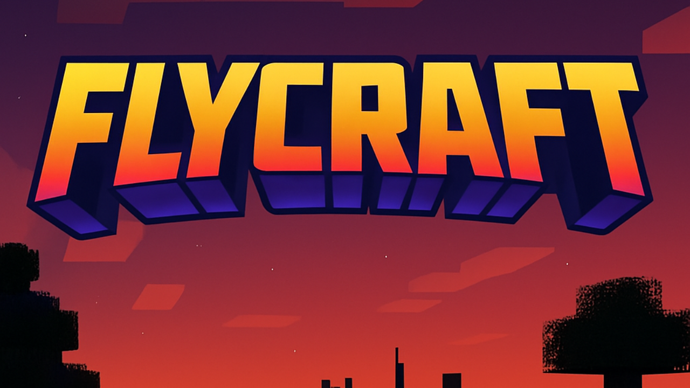

<div align="center">
    
</div>

# 🛸 FlyCraft 1.0
### Advanced Flight & Animation System for Minecraft Forge

> A powerful client-side mod that brings dynamic flight mechanics and fluid animations to Minecraft 1.20.1, empowering players with graceful aerial movement and visual flair.

**For players and modders, by developers.** Smooth flight that slaps⚡

---

<div align="center">


</div>

---

## 🎉 FlyCraft 1.0 Release Highlights

Welcome to the **official release of FlyCraft 1.0**! This version includes:

### ✨ Features Included

- ✅ **Complete Animation System** - 7 pre-built animations with smooth easing functions
- ✅ **Advanced Flight Mechanics** - Responsive elytra flight with jet mode acceleration
- ✅ **Particle Effects System** - 6 dynamic particle effect types for visual polish
- ✅ **Easy Keybinds** - Pre-configured animation triggers (V, C, B, X, Z keys)
- ✅ **Jet Mode Overlay** - Immersive visual feedback system with speed-based effects
- ✅ **Zero Dependencies** - Pure Forge implementation, no external mod dependencies
- ✅ **Professional Documentation** - Comprehensive guides and troubleshooting resources
- ✅ **Production Ready** - Fully tested on Minecraft 1.20.1 Forge

### 🔄 From Beta to 1.0

This release represents the culmination of development work focusing on:
- Stability and performance optimization
- Animation system initialization and lifecycle management
- Comprehensive documentation and troubleshooting guides
- Professional README and cover art

---
-
<div align="center">
    <video controls width="960" poster="./assets/cover-banner.png">
        <source src="./assets/FLYCRAFT.mp4" type="video/mp4">
        Your browser does not support the video tag. <a href="./assets/FLYCRAFT.mp4">Download the demo</a>.
    </video>
</div>

- **Dynamic Flight System** - Smooth, responsive elytra flight with adjustable speed and control
- **Advanced Animation Engine** - 7+ built-in animations including flight, gliding, jumping, and dances
- **Jet Mode Overlay** - Immersive visual feedback system with speed lines, vignette effects, and G-force blur
- **Particle Effects** - 6 dynamic particle effect types (burst, spiral, trail, dust, sparkle, wave)
- **Easy Keybinds** - Pre-configured animation triggers (V, C, B, X, Z keys)
- **Aerobatics Manager** - Advanced flight maneuver system for experienced players
- **Client-Side Only** - No server installation required, works on any vanilla server
- **Zero Dependencies** - Pure Forge implementation with no external mod dependencies
- **Customizable** - Easily modify animations, speeds, and effects to fit your playstyle

---
<div align="center">
    <video controls width="960" poster="./assets/cover-banner.png">
        <source src="./assets/FLYCRAFT.mp4" type="video/mp4">
    </video>
</div>
---

## 🎮 Quick Start

### Prerequisites
- **Minecraft**: 1.20.1
- **Java**: Java 21 LTS (recommended) or Java 8+
- **Forge**: 47.4.10 or compatible version

### Installation

1. **Download the mod**

    Note: There is no official release uploaded yet. You have two options:

    - Build the JAR locally (recommended for developers and power users)
    - Create a GitHub Release and attach the built JAR so others can download it

    Build locally (PowerShell / Windows):

    ```powershell
    # From the repository root
    .\gradlew.bat clean build

    # After build, the mod JAR will be at:
    # build\libs\flycraft-1.0.jar
    ```

    Build locally (Unix/macOS):

    ```bash
    ./gradlew clean build
    # build/libs/flycraft-1.0.jar
    ```

    Make the JAR publicly available (manual GUI):

    1. Go to your repository on GitHub → "Releases" → "Draft a new release".
    2. Tag version: `v1.0` (or choose your tag name).
    3. Title: `FlyCraft 1.0`.
    4. Upload the file `build/libs/flycraft-1.0.jar` as a release asset.
    5. Add release notes (you can paste contents from `RELEASE_NOTES.md`).
    6. Publish release — the JAR will be visible to the public on the Releases page.

    Make the JAR publicly available (gh CLI):

    ```powershell
    # Tag locally and push tag
    git tag v1.0
    git push origin v1.0

    # Create a release and upload the artifact (requires GitHub CLI 'gh' installed and authenticated)
    gh release create v1.0 build\libs\flycraft-1.0.jar --title "FlyCraft 1.0" --notes-file RELEASE_NOTES.md
    ```

    Alternative: If you prefer not to create a GitHub Release, you may upload the JAR to a distribution platform such as Modrinth or CurseForge and link to it here.

2. **Install to Minecraft**
   ```
   Place the JAR file in your Minecraft mods folder:
   %APPDATA%\.minecraft\mods\
   ```
   OR on Linux/Mac:
   ```
   ~/.minecraft/mods/
   ```

3. **Launch Minecraft**
   - Select your Forge profile
   - Enjoy enhanced flight mechanics!

### Build from Source

```bash
# Clone the repository
git clone <your-repo-url>
cd FlyCraft

# Build the project (Unix/macOS)
./gradlew clean build

# Or on Windows PowerShell
.\gradlew.bat clean build

# The built JAR will be in:
# build/libs/flycraft-1.0.jar

# Run in development
./gradlew runClient
```

---

## 🎯 Usage Guide

### Basic Flight Controls

| Action | Control |
|--------|---------|
| Equip Elytra | Normal Minecraft mechanics |
| Ascend | Jump while falling + Move forward |
| Dive | Sneak while flying |
| Glide | Release all movement keys |
| Jet Mode | Special acceleration mode (flight speed boost) |

### Animation Keybinds

| Key | Animation | Duration | Effect |
|-----|-----------|----------|--------|
| **V** | Wave | 1.0s | Wave greeting gesture with particles |
| **C** | Clap | 1.5s | Hand clapping motion |
| **B** | Dance | 2.0s | Full body dance with sway |
| **X** | Spin | 1.0s | Body rotation |
| **Z** | Jump Boost | 0.4s | Crouch and spring animation |

### Particle Effects

Each animation can trigger particle effects:
- **Burst Effect** - Particles explode outward in all directions
- **Spiral Effect** - Particles spiral around the player
- **Trail Effect** - Particles follow player movement
- **Dust Effect** - Dust particles surrounding the player
- **Sparkle Effect** - Magical sparkle particles
- **Wave Effect** - Wave-like particle pattern

---

## 🏗️ Project Structure

```
FlyCraft/
├── assets/
│   └── cover-banner.svg              # FlyCraft 1.0 cover image
├── src/
│   └── main/
│       ├── java/com/sameeran/flycraft/
│       │   ├── FlyCraftMod.java              # Main mod entry point
│       │   ├── FlightController.java         # Core flight mechanics
│       │   ├── AerobaticsManager.java        # Advanced maneuvers
│       │   ├── FlightModeManager.java        # Flight mode logic
│       │   ├── ClientEvents.java             # Event handling
│       │   ├── HUDOverlay.java               # Visual overlays
│       │   ├── JetModeOverlayRenderer.java   # Jet mode effects
│       │   ├── ClientRegistry.java           # Client-side registry
│       │   └── animation/                    # Animation system v1.0
│       │       ├── Animation.java            # Base animation class
│       │       ├── EasingFunction.java       # Easing curves
│       │       ├── AnimationManager.java     # Animation registry
│       │       ├── AnimationController.java  # Event subscriber
│       │       ├── AnimationKeybinds.java    # Keybind definitions
│       │       ├── ParticleEffects.java      # Particle system
│       │       └── [7 animation types]       # Specific animations
│       └── resources/
│           ├── pack.mcmeta
│           ├── META-INF/mods.toml
│           └── assets/flycraft/
│               ├── lang/en_us.json
│               └── textures/
├── build.gradle                              # Gradle configuration
├── settings.gradle
├── gradle.properties
├── DOCUMENTATION_INDEX.md                    # Full docs reference
├── README.md                                 # This file (FlyCraft 1.0)
└── LICENSE.txt                               # MIT License
```

---

## 🚀 Animation System

### Architecture Overview

The FlyCraft animation engine is built on a modular, event-driven architecture:

```
AnimationController (Forge Events)
    ├── tick() event → Updates active animations
    ├── render() event → Applies visual changes
    └── Initialization on first render
    
AnimationManager (Registry)
    ├── Registers animations
    ├── Manages lifecycle
    └── Queues animation sequences
    
Specific Animations (7 types)
    ├── FlyingAnimation
    ├── SpinAnimation
    ├── GlideAnimation
    ├── JumpBoostAnimation
    ├── WaveAnimation
    ├── ClapAnimation
    └── DanceAnimation
```

### Adding Custom Animations

Create a new class extending `Animation`:

```java
public class MyCustomAnimation extends Animation {
    public MyCustomAnimation() {
        super(1.0f, true); // 1.0 second duration, looping
    }
    
    @Override
    public void apply(PlayerModel<?> model, float progress) {
        // Apply pose changes based on progress (0.0 to 1.0)
        model.rightArm.xRot = progress * 0.5f;
    }
}
```

Register in `AnimationManager`:

```java
public static void registerAnimation(String key, Animation animation) {
    ANIMATIONS.put(key, animation);
}
```

Trigger with keybind in `ClientEvents`:

```java
if (AnimationKeybinds.WAVE_KEY.consumeClick()) {
    AnimationController.playAnimation(new WaveAnimation());
}
```

---

## ⚙️ Configuration & Customization

### Flight Speed Adjustment

Edit `FlightController.java`:

```java
private static final double MAX_FLIGHT_SPEED = 2.8; // Blocks per second
```

### Animation Duration Modification

Each animation class defines its duration:

```java
// In WaveAnimation.java
super(1.0f, false); // Change first parameter (duration in seconds)
```

### Easing Functions

Choose from 6 easing curves in animations:

- `EasingFunction.LINEAR` - Constant speed
- `EasingFunction.EASE_IN` - Slow start
- `EasingFunction.EASE_OUT` - Slow end
- `EasingFunction.EASE_IN_OUT` - Smooth both ends
- `EasingFunction.ELASTIC` - Bouncy effect
- `EasingFunction.BOUNCE` - Bouncing effect

---

## 🔧 Build Configuration

### Java Version
Default target: **Java 21 LTS**

To use a different Java version, modify `build.gradle`:

```gradle
def targetJavaVersionString = project.hasProperty('targetJavaVersion') ? 
    project.property('targetJavaVersion') : '21'
```

### Building the Mod

```bash
# Clean build
./gradlew clean build

# Run tests
./gradlew test

# Development run
./gradlew runClient

# Prepare development environment
./gradlew prepareRunClientCompile
```

---

## 📋 Keybind Configuration

All keybinds are defined in `AnimationKeybinds.java`:

```java
public static final KeyMapping WAVE_KEY = new KeyMapping(
    "key.flycraft.wave",
    InputConstants.KEY_V,
    "key.categories.gameplay"
);
```

To modify:
1. Change the `InputConstants.KEY_*` value
2. Rebuild the mod
3. Keybind will appear in Minecraft's Controls settings

---

## 🐛 Troubleshooting

### Animations Not Showing

1. **Check Console** - Look for `[FlyCraft]` messages
2. **Verify Keybinds** - Confirm keys aren't bound to other actions
3. **Rebuild Project** - Run `./gradlew clean build`
4. See [ANIMATION_TROUBLESHOOTING.md](./ANIMATION_TROUBLESHOOTING.md) for detailed diagnostics

### Flight Not Working

- Ensure you're wearing an elytra
- Check that mod loads (look for `[FlyCraft]` in client log)
- Verify Forge version compatibility (47.4.10 recommended)

### Build Errors

```bash
# Refresh dependencies
./gradlew --refresh-dependencies

# Full clean
./gradlew clean build --refresh-dependencies
```

---

## 📚 Documentation

- **[ANIMATION_TROUBLESHOOTING.md](./ANIMATION_TROUBLESHOOTING.md)** - Comprehensive animation diagnostics
- **[ANIMATION_DIAGNOSTIC.md](./ANIMATION_DIAGNOSTIC.md)** - Step-by-step verification checklist
- **[ANIMATION_FIX.md](./ANIMATION_FIX.md)** - Quick fix guide for common issues
- **[DOCUMENTATION_INDEX.md](./DOCUMENTATION_INDEX.md)** - Full documentation index

---

## 🛠️ Tech Stack

| Component | Technology |
|-----------|-----------|
| **Framework** | Minecraft Forge 47.4.10 |
| **Minecraft Version** | 1.20.1 |
| **Build Tool** | Gradle 8.8 |
| **Language** | Java 21 LTS |
| **Architecture** | Event-Driven (Forge Event Bus) |
| **Rendering** | Minecraft RenderEvents |

---

## 🤝 Contributing

We welcome contributions! Here's how to help:

### Adding New Animations

1. Create a new class in `src/main/java/com/sameeran/flycraft/animation/`
2. Extend the `Animation` base class
3. Implement the `apply()` method
4. Register in `AnimationManager`
5. Add a keybind in `AnimationKeybinds`
6. Update documentation

### Improving Flight Mechanics

1. Modify `FlightController.java` for flight behavior
2. Test with `./gradlew runClient`
3. Submit a pull request with description

### Bug Reports

- Open an issue with reproduction steps
- Include Minecraft/Forge version
- Attach relevant log excerpts

### Pull Request Process

1. Fork the repository
2. Create a feature branch: `git checkout -b feature/your-feature`
3. Commit with clear messages: `git commit -m "feat: add cool animation"`
4. Push to branch: `git push origin feature/your-feature`
5. Open pull request with description

---

## 📝 License

This project is licensed under the **MIT License** - see [LICENSE.txt](./LICENSE.txt) for details.

---

## 🙏 Acknowledgments

- Built with **Minecraft Forge**
- Inspired by popular mods like "Actions and Stuff"

---

## 👨‍💻 Built By

**Sameeran** - Developer & Maintainer
- GitHub: [@spongebob2005](https://github.com/spongebob2005)
- Minecraft IGN: Sameeran

---

## ⭐ Star History

If you enjoy FlyCraft, please consider giving it a ⭐ on GitHub and sharing it with other Minecraft enthusiasts!

```
Happy flying! 🛸✨
```
